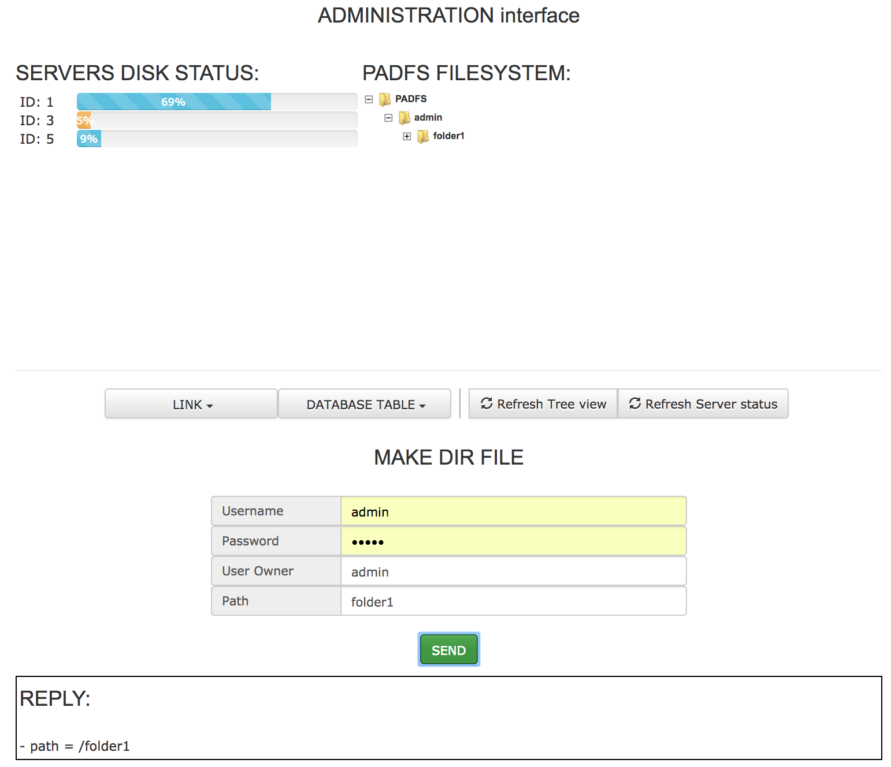
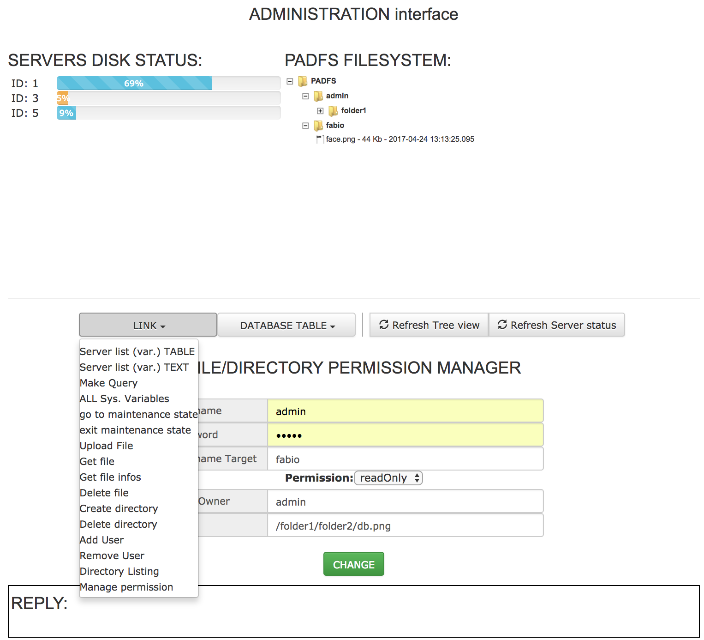
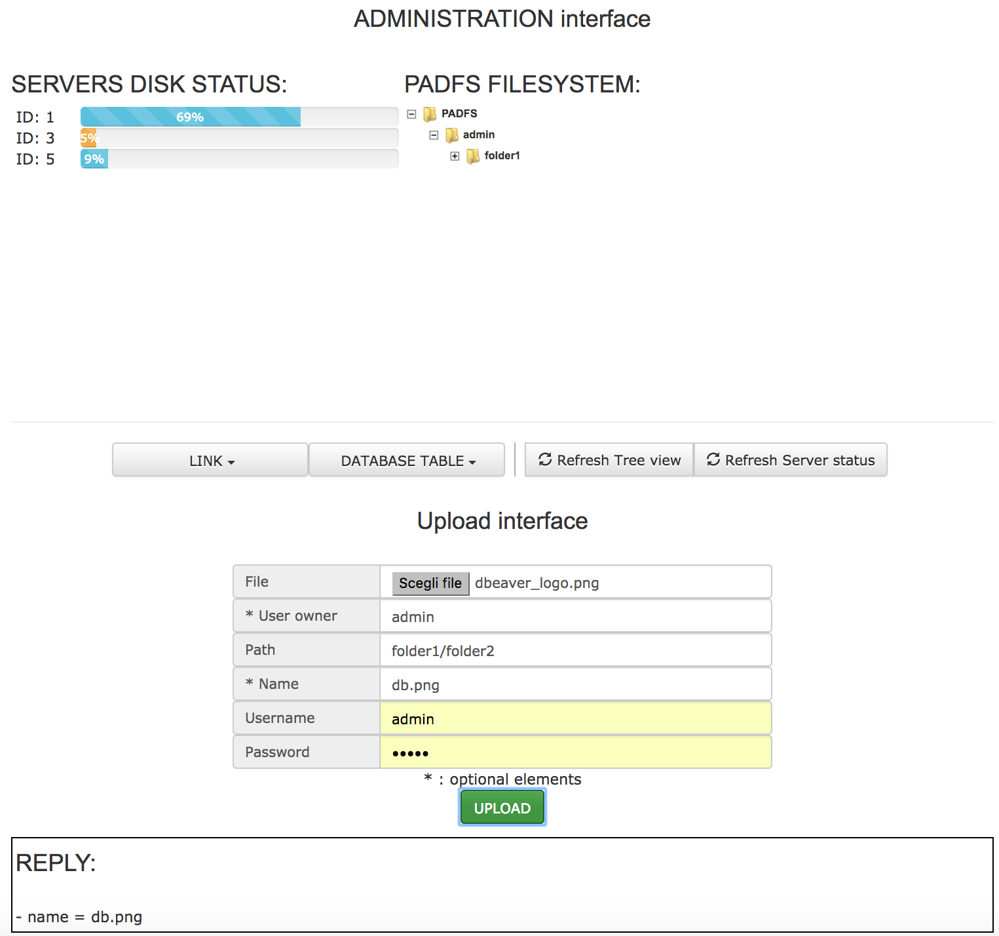
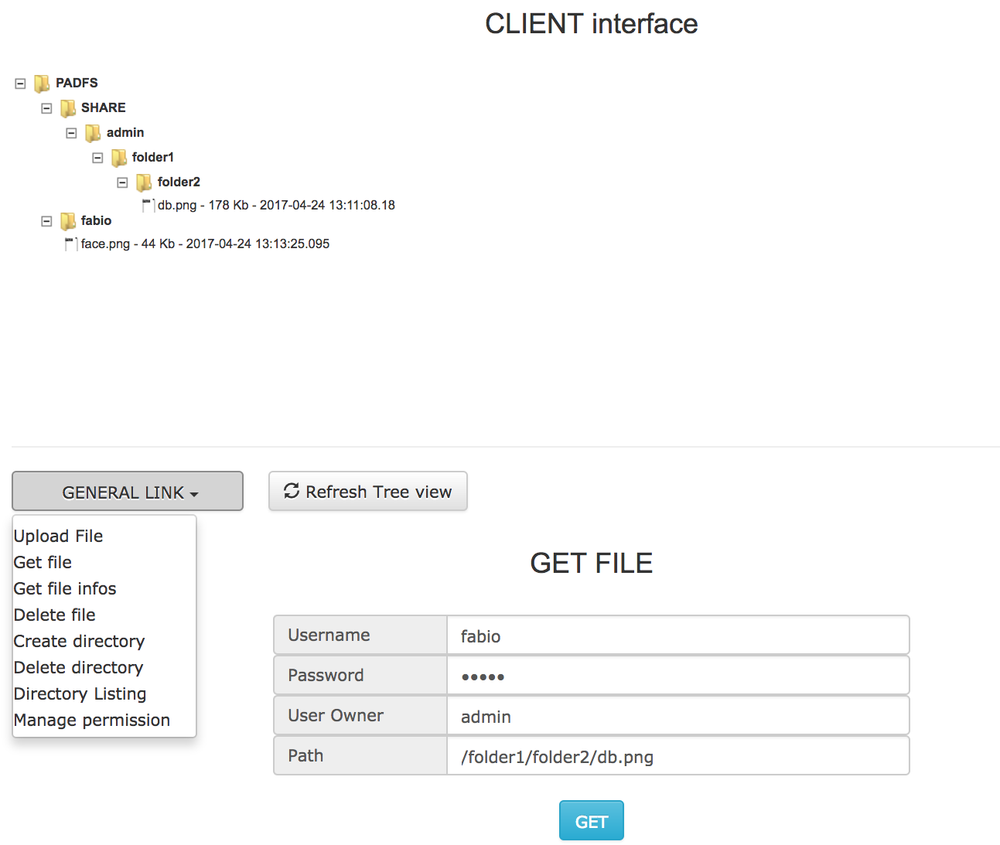

[workflow]: img/workflow.png "padfs workflow"
[database]: img/databaseSchema.png "padfs database"


[authors]: #authors
[introduction]: #introduction
[build]: #build-and-run-project
[configurationFile]: #configuration-file
[accessUtiliziation]: #access-and-utilization-of-the-web-interface
[workflow]: #workflow
[projectStructure]: #project-structure
[consistencyModel]: #consistency-model
[dataReplication]: #data-replication
[availability]: #availability-and-partition-tolerance
[loadBalance]: #load-balance
[database]: #database-structure


Index
======
1. [Authors][authors]
2. [Introduction][introduction]
3. [Build and run][build]
4. [Configuration file][configurationFile]
5. [Access and utilization of the web interface][accessUtiliziation]
6. [Workflow][workflow]
7. [Project structure][projectStructure]
8. [Consistency model][consistencyModel]
9. [Data replication][dataReplication]
10. [Availability and Partition tolerance][availability]
11. [Load balance][loadBalance]
12. [Database structure][database]

Authors
======

* Fabio Lucattini
* Matteo Mazza

Introduction
======

PADFS is a distributed, multi-tenant, persistent, hierarchical file system.
The user’s files stored in the file system can be organized in a hierarchical way through directories. Moreover the users can share their folders and files with one or more users specifying, for each user, a particular permission.
The service is exposed to the users as a REST web service and through a web interface.

Build and run project
======
```
1. mvn package
2. java -jar padfs-0.1-developer.jar config.xml
```

Screenshot
======
Admin interface directory creation: <br>
<center></center>
<br>

Admin interface modify permission: <br>
<center></center>
<br>

Admin interface upload file: <br>
<center></center>
<br>

User interface download file: <br>
<center></center>
<br>

Configuration file
======
The configuration file is an xml file named “config.xml” stored in the same directory of PADS jar.

It is structured as the following:

* configuration: the xml element including all the PADFS configuration

    * server: the xml element including the information to describe the PADFS instance

        * id: the unique id of this instance of PADFS-node. If missing, PADFS will generate an unique id available in the system.

        * ip: the ip address of the REST interface. it can be '\*' to include all the available ip addresses

        * port: the port of the REST interface

        * protocol: one of “http”, “https”. It is the protocol that this PADFS-node will use for each its REST interaction.

        * fileCertPath: the path of the spring keyStore file. Mandatory only if the protocol choosen is “https”

        * fileCertPassword: the path of the spring keyStore password file. Mandatory only if the protocol choosen is “https”

    * system: the xml element including parameters that change the behaviour of the PADFS-node. Most of them are optional.

        * retryNumber: in case of failure, the number of trials for each REST request that the PADFS-node does. default: 3

        * waitMillisecondsBeforeRetry: the number of milliseconds that the PADFS-node will wait in case of failure in a REST request before it will retry it. default: 1000

        * sleepTime_CheckReplicasAlive: the number of milliseconds that the FileManager waits between 2 consecutive check of available replicas. default:60000

        * waitBeforeSynch: after having noticed that this PADFS-node is out of synch, the PADFS-node will wait for ‘waitBeforeSynch’ milliseconds before start a synchronization. This is done to avoid unneeded synchronizations due to network delay or temporary overloading of the PADFS-node that has buffered messages not yet consumed. default: 3000

        * waitMillisecondsHeartbeat: the sleeping time between 2 consecutive Heartbeat routines. default: 30000

    * log: the xml element including the classic log parameters

        * path: the path where to store the log file

        * overwrite: a boolean parameter. If true, the log file will be overwritten at each instantiation of PADFS. If false, a rotation mechanism is implemented

        * level: the level of logging. It can be one of the following: ERROR; WARNING; INFO; DEBUG; TRACE

        * colouredOutput: an optional boolean parameter that indicates if the console output must be black and white or coloured. default: false

    * password: the xml element including all PADFS passwords

        * server: the shared password used for communication between PADFS-nodes. It must be the same in all the configuration files.

        * controlPanel: the password used to access the control panel

    * fileSystem: the xml element including the parameters needed to determine where PADFS will store its files

        * path: the path where PADFS will store the permanent data of the users

        * TMPPath: the path of the temporary directory of PADFS

    * serverList: the xml element containing a list of configuration/serverList/server elements. These elements describe the REST endpoints of other PADFS-nodes.

        If PADFS is not booted yet, at least one PADFS-node must have at least 2 endpoint setted. Otherwise if PADFS is already booted, it is sufficient to include only the endpoint of one PADFS-node already accepted in the PADFS net.

        * server: the xml element describing the REST endpoint of one PADFS node

            * ip
            * port

Access and utilization of the web interface
======

PADFS is very simple and intuitive to use thanks to the web interface both for users and the administrator. The web interface provides a simple and basic user interface for the PADFS REST api that can be exploited to create more powerfull tools and complex interfaces.

When at least 3 PADFS-nodes are connected and ready, the operations in the web page are unlocked and the PADFS-nodes are capable to receive the user’s files to be uploaded.
To reach web interface we give two entry point: the users interface and the administrator interface:

* **Users interface**: ``` http://<server-ip>:<port> ```
* **Administrator interface**: ``` http://<server-ip>:<port>/management ```

After the first boot of PADFS, only one user is present in the client interface, with username admin and password admin by default, if not differently specified in the configuration file.

Workflow
======
![padfs project workflow][workflow]

Project structure
======

The project is organized in 4 main packages:
1. **padfsThreads**

     * Padfs: Responsible of booting the system.

     * Heartbeat: It monitor the PADFS network to maintain an updated network status.

     * Shutdown: It intercept the system interrupt to gracefully shutdown the node.

     * GarbageCollector: It monitors the PADFS local data and remove the no more required data.

     * Rest Interface: The Rest Interface component lets the interaction from the outside with the PADFS-node. It implements a server listening for incoming rest-messages.

     * PrepareOp: The PrepareOp component continuously reads job-operations from the queue, execute some preliminary steps and finally send forward the job-operation.

     * Consensus: The consensus component continuously reads initialized job-operations through green socket and it tries to reach an agreement between other PADFS-nodes to finalize them. Moreover it continuously reads consensus-messages through red socket to complete the consensus algorithm and to receive agreed job-operations to be finalized.

     * CompleteOp: The CompleteOp component continuously read job-operations through yellow socket and executes their final steps.

     * Garbage Collector: The Garbage Collector component periodically scans the local file-system to discover no more needed data that can be deleted.

     * Heartbeat: The Heartbeat component periodically queries other PADFS-nodes to maintain updated the network status.

     * File Manager: The File Manager component periodically scans the PADFS-nodes to check and to maintain available the replicas of the data managed by its PADFS-node.

     * FileManager: It monitors the PADFS network to guarantee the replication of the user data.

     * Consensus: It communicates with the other PADFS-nodes to agree on the proposed operations.

     * CompleteOp: It executes the finalization phases of all operations.

     * PrepareOp: It executes the initialization phases of all operations.

2. **jobManagement**: This package contains the classes representing PADFS operations. At the arrival of a message from the net, the rest interface create one or more instances of this classes.
These classes can be classified into 2 sub-packages:
     * consensus: The classes instances of this package are created in the RestInterface component and reach the Consensus component through red sockets described in the workflow paragraph.
     The jobManagement.consensus instances are:
        * Prepare: Manage the receive of Prepare messages and send the Reply messages to the server that has started the new consensus request.
        * Propose: Manage the receive of Propose messages.
        * Accept: Manage the receive of Accept messages.

     * jobOperation: The classes instances of this package are created in the RestInterface component and reach the PrepareOp component through the blue sockets described in the workflow paragraph. The PrepareOp thread, for each jobOperation read, computes the preliminary operations defined by the jobOperation itself and forwards it to the Consensus component. The Consensus thread transmits the operation to all the involved PADFS-nodes in a jobManagement.consensus.Prepare object and it agrees on the execution of the jobOperation. Then the jobOperation reaches the CompleteOp component and its execution can be completed.
     The jobOperations are subdivided in 3 sub-packages:
        * clientOp: It contains all the operations that a client can request.
        * manageOp: It contains all the internal operations used to maintain the integrity of the PADFS-node.
        * serverOp: It contains all the operations that a PADFS-node can request to other PADFS-nodes.

3. **system**: This package contains the classes utilized to define components that are used by other packages:
    * consensus: it maintains the status variables necessary to the consensus component.
    * containers: it defines the internal data structure utilized in the system. For instance User.java contains all the information needed to define a user like username and password.
    * logger: it implements the logging system.
    * managementOp: it includes all the system routines necessary to maintain the PADFS shared status.
    * managers: it implements all the interfaces that the system use to interact with external component like DBMS, local file system and configuration file.
    * merkeTree: it contains the metadata contained in the distributed file system.

4. **restInterface**: This package contains the classes that defines the rest interface. It includes the wrappers needed to represent JSON network messages as java objects. They are subdivided in the sub-packages:
    * consensus
    * manageOp
    * op


Consistency model
======
The PADFS consistency model is the sequential consistency.
The execution of a sequence of operations is sequentially consistent if the results of the execution is the same as if the operations were executed in some sequential order, and the operations of each individual node appear in this sequence in the order specified by the node.

In PADFS, each operation done on the same file is sequentialized because that operations are performed inside the same consensusGroup that approves one operation at the time. Thus each PADFS-node belonging to the consensusGroup, executes the approved operations in the same order.

Data replication
======
PADFS eventually leads to store 3 copies of each file. The replication of the data is achieved creating 3 copies of each file stored with a PUT operation. Moreover, for each file there are 3 PADFS-nodes designated to periodically check the availability of the copies. This PADFS-nodes will create new copies in case of failures or network partitions attempting to maintain 3 available copies in each network partition. If more than 3 copies are present in the network, PADFS will eventually delete the excess copies.

Availability and Partition Tolerance
======
PADFS is partition tolerant, it continues to operate also in highly unreliable network.
In order to grant the consistency model, it does not provide a 100% availability.
From a client perspective, the main operations on PADFS are uploading and downloading files and these are the requirements for their availability:

* Upload: The upload operation is available if the client is in the network-subset that contains the majority (at least 50%+1) of PADFS-nodes that are involved in the execution of the consensus problem for this operation.

* Download: The download operation is available if the client is in a network-subset in which there is at least one available PADFS-node that manages the file and at least one available PADFS-node that manage the metadata of that file.

Load balance
======
Load balance is implemented as a distribution of: data, metadata and computation among the PADFS-nodes.

The uploaded data by the users and their replicas are distributed among the PADFS-nodes. Our goal is to maintain the same percentage of disk occupancy on each node, siìo the uploaded data is stored in the server with fewer disk occupancy.

Database structure
======

PADFS utilizes a database, together to the local file system, to store all the data and metadata necessary to maintain the client files and the PADFS status.
The data is partially shared with all the PADFS-nodes.

![padfs project database][database]
